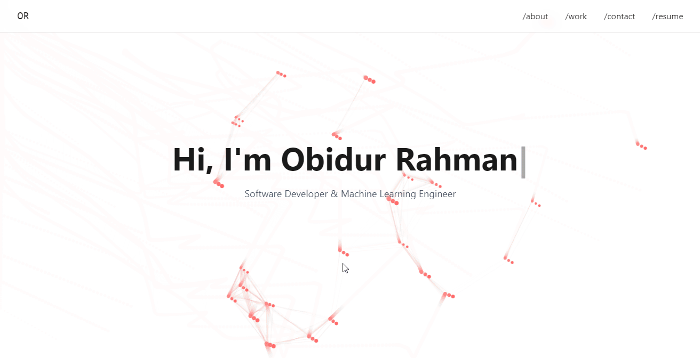

# 🌐 Modern Responsive Portfolio Template

A sleek and fully responsive **portfolio website template** built with **HTML**, **TailwindCSS**, and **Vanilla JavaScript**. This template features smooth scrolling, interactive animations, and a polished UI—perfect for showcasing your work.

## 📷 Screenshots




## 🚀 Features

- 🎨 **Interactive Particle Background** – Eye-catching visual effects.
- 📜 **Smooth Scroll & Section Snap** – Seamless navigation experience.
- 📱 **Mobile-Friendly Design** – Optimized for all screen sizes.
- ⌨️ **Typewriter Effect** – Dynamic text animation in the hero section.
- 🏆 **Project Showcase** – Interactive hover effects.
- 🛠 **Skills Display** – Organized badge-based skills section.
- 📩 **Contact Form** – Direct email integration for inquiries.

## 🛠 Tech Stack

- **HTML5** – Clean and semantic structure.
- **TailwindCSS** – Utility-first styling for rapid development.
- **Vanilla JavaScript** – Lightweight interactions.
- **Canvas API** – Custom animations for a modern look.

## 📦 How to Use

1. **Clone the Repository:**
   ```bash
   git clone https://github.com/yourusername/yourportfolio.git
   ```
2. **Navigate to the Project Directory:**
   ```bash
   cd yourportfolio
   ```
3. **Open in Browser:**
   ```bash
   npx serve
   ```
   *(Alternatively, use Live Server in VS Code for real-time updates.)*

## 📁 Folder Structure

```
yourportfolio/
├── index.html        # Main HTML file
├── styles.css        # TailwindCSS styles
├── img/              # Assets and images
├── resume.pdf        # Your latest resume
└── README.md         # Documentation
```

## 🎨 Customization Guide

Make it yours in a few easy steps:

- ✏️ **Personal Details:** Edit `index.html` to update your name, bio, and links.
- 🎨 **Theme & Colors:** Modify `styles.css` (TailwindCSS classes) to fit your style.
- ✨ **Animations & Effects:** Adjust `script.js` to tweak particle animations.
- 🏗 **Projects & Skills:** Update the projects section in `index.html` with your work.

## 📜 License

This template is open-source under the **MIT License**—use, modify, and share it freely!

## 📧 Get in Touch

Need help or have suggestions? Reach out via email:  
📩 your.email@example.com

---

🚀 **Start building your personal brand today!**